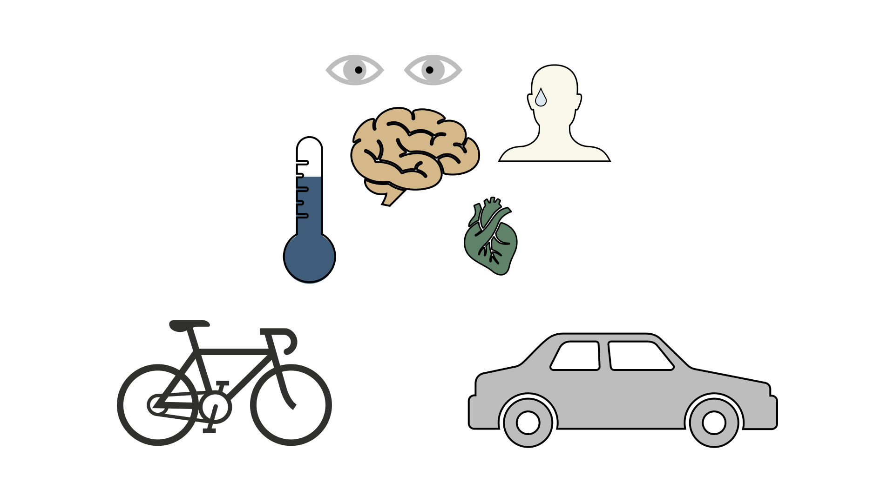

# Computer Scientist

#### Technical Skills: Python, SQL, AWS, Snowflake, MATLAB

## Education		        		
B.S., Computer Science | Balochistan University of IT Engineering and Management Sciences (_Sep 2023_)
- Final grade: CGPA 3.77/4 

## Work Experience
**Digital Associate @ United Bank Limited, Pakistan (_Jan 2024 - Present_)**
- Uncovered and corrected missing step in production data pipeline which impacted over 70% of active accounts

**IT Research & Development Intern @ Control Automation and Robotics Lab, Pakistan (_Aug 2022 - Sep 2023_)**
- Uncovered and corrected missing step in production data pipeline which impacted over 70% of active accounts

**IT Support Lead @ Kasi Bahria Town, Pakistan (_Aug 2020 - Sep 2022_)**
- Uncovered and corrected missing step in production data pipeline which impacted over 70% of active accounts
- Redeveloped loan originations model which resulted in 50% improvement in model performance and saving 1 million dollars in potential losses

**Digital Assistant @ Cyfire, Germany (Remote) (_December 2020 - Present_)**
- Conducted data collection, processing, and analysis for novel study evaluating the impact of over 300 biometrics variables on human performance in hyper-realistic, live-fire training scenarios
- Applied unsupervised deep learning approaches to longitudinal ICU data to discover novel sepsis sub-phenotypes

**Web Designer/Developer @ Oceanic Entertainment, Canada (Remote) (_December 2020 - Present_)**

## Projects
### Data-Driven EEG Band Discovery with Decision Trees
[Publication](https://www.mdpi.com/1424-8220/22/8/3048)

Developed objective strategy for discovering optimal EEG bands based on signal power spectra using **Python**. This data-driven approach led to better characterization of the underlying power spectrum by identifying bands that outperformed the more commonly used band boundaries by a factor of two. The proposed method provides a fully automated and flexible approach to capturing key signal components and possibly discovering new indices of brain activity.

### Decoding Physical and Cognitive Impacts of Particulate Matter Concentrations at Ultra-Fine Scales
[Publication](https://www.mdpi.com/1424-8220/22/11/4240)

Used **Matlab** to train over 100 machine learning models which estimated particulate matter concentrations based on a suite of over 300 biometric variables. We found biometric variables can be used to accurately estimate particulate matter concentrations at ultra-fine spatial scales with high fidelity (r2 = 0.91) and that smaller particles are better estimated than larger ones. Inferring environmental conditions solely from biometric measurements allows us to disentangle key interactions between the environment and the body.

## Talks, Presentations and Articles
- Causality: The new science of an old question - GSP Seminar, Fall 2021
- Guest Lecture: Dimensionality Reduction - Big Data and Machine Learning for Scientific Discovery (PHYS 5336), Spring 2021
- Guest Lecture: Fourier and Wavelet Transforms - Scientific Computing (PHYS 5315), Fall 2020
- A Brief Introduction to Optimization - GSP Seminar, Fall 2019
- Weeks of Welcome Poster Competition - UTD, Fall 2019
- A Brief Introduction to Networks - GSP Seminar, Spring 2019

- [Data Science YouTube](https://www.youtube.com/channel/UCa9gErQ9AE5jT2DZLjXBIdA)

## Publications
1. Talebi S., Lary D.J., Wijeratne L. OH., and Lary, T. Modeling Autonomic Pupillary Responses from External Stimuli Using Machine Learning (2019). DOI: 10.26717/BJSTR.2019.20.003446

- [Data Science Blog](https://medium.com/@shawhin)
